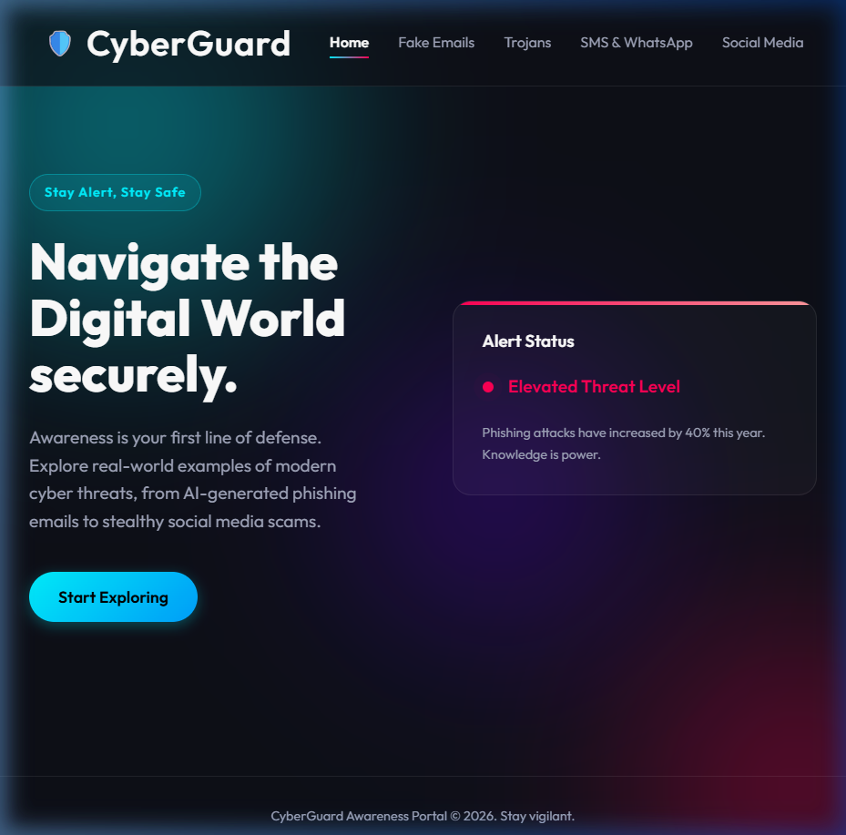
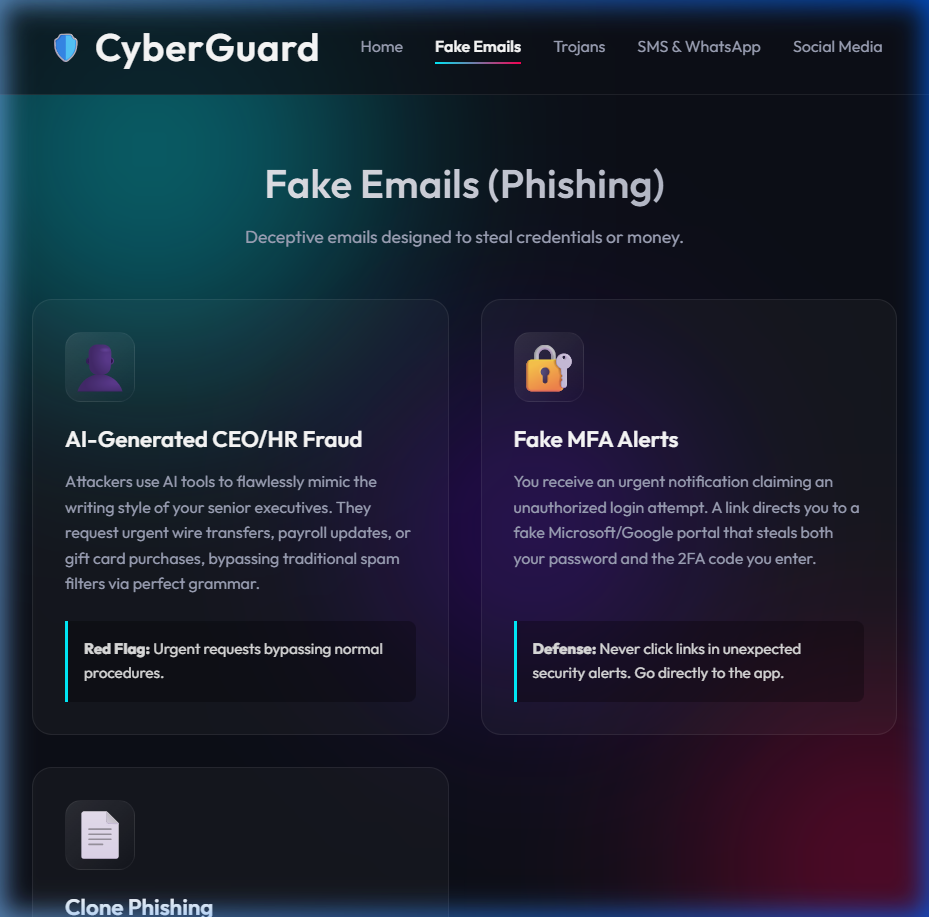
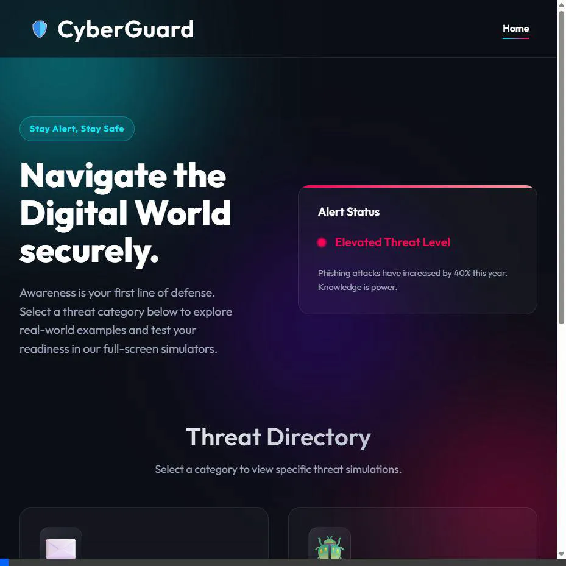

# CyberGuard Awareness Portal

A highly immersive, interactive Single-Page to Multi-Page Application (MPA) designed to train users on identifying and mitigating modern cybersecurity threats and phishing scams.

## Overview

CyberGuard was built to provide a realistic, hands-on training experience. By utilizing a **Full-Page Immersion** architecture, users don't just read about scams—they interact with mock user interfaces (UIs) that simulate receiving a malicious text message, email, or WhatsApp message and are forced to make a decision. 

## Key Features

-   **Modern Aesthetics**: Built with a sleek dark-mode UI, glassmorphism cards, and dynamic background animations.
-   **Multi-Page Architecture (MPA)**: Clean separation of concerns with dedicated pages for different threat vectors.
-   **Interactive Simulators**: Click any threat example to launch a full-screen, distraction-free mock simulation of the attack.
-   **Immediate Feedback & Education**: Choosing the wrong (or right) action immediately provides consequences, followed by a Deep Dive Threat Analysis (How it Works, Red Flags, Defense Protocol).

## Threat Categories Covered (12 Total Scams)

1.  **Fake Emails**: AI-Generated CEO/HR Fraud, Fake MFA Alerts, Clone Phishing.
2.  **Trojan Horses**: Astaroth Banking Trojan, Trojan-IM App Hijack, "WhatsApp Gold" Hoax.
3.  **Mobile Scams**: Smishing (Account Limitation), Package Delivery SMS, WhatsApp "GhostPairing".
4.  **Social Media**: Friend-in-Need Scams, Steganography Image Payloads, Payment Gateway Spoofing.

---

## 📸 Snapshots and Demos

*(Note: The media files below are included in this project directory)*

### The Home Directory
The entry point featuring the dynamic background and categorical navigation.


### Category Pages
Dedicated pages listing specific scams with hover animations on the glass cards.


### 🎬 Interactive Simulator Demo (Video)
Watch the full interaction flow: navigating from the home directory, selecting the **AI-Generated CEO Fraud** example, interacting with the full-screen mock email UI, and viewing the Threat Analysis feedback.


---

## Technical Stack
-   **HTML5**: Semantic web structure.
-   **CSS3**: Custom variables, flexbox/grid layouts, keyframe animations, backdrop filters.
-   **Vanilla JavaScript**: Zero dependencies. Handles URL query routing (`?id=xyz`), dynamic data injection, and simulator state logic.

## How to Run Locally

Because this is a static site using Vanilla JS and CSS, no complicated build steps are required.

1.  Open the project folder (`try` folder) in your terminal.
2.  Start a local Python HTTP server:
    ```bash
    python -m http.server 8000
    ```
3.  Open your browser and navigate to:
    ```
    http://localhost:8000/
    ```

## File Structure

-   `index.html`: The main landing directory.
-   `emails.html`: Phishing examples page.
-   `trojans.html`: Malware examples page.
-   `mobile.html`: SMS/WhatsApp examples page.
-   `social.html`: Social network examples page.
-   `simulator.html`: The dynamic full-screen simulator engine.
-   `style.css`: The global design system.
-   `data.js`: The centralized database containing all 12 scam examples, their mock text, and the educational content.
-   `*.png` / `*.webp`: Project screenshots and demo recordings.
